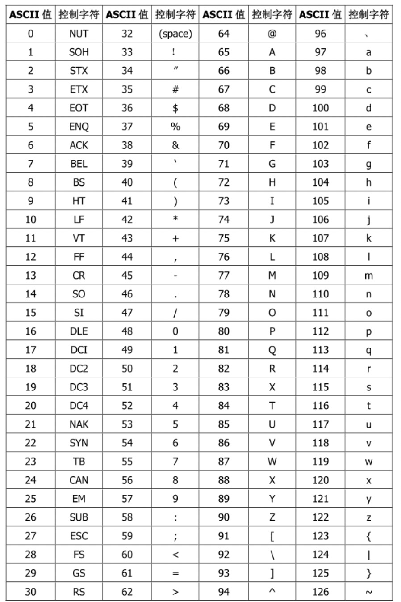
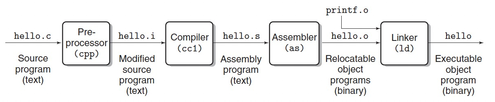

# 1.1 Information is Bits + Context
本章以C语言程序hello.c为例：

```hello.c
#include <stdio.h>

int main(){
    printf("Hello World!\n");
    return 0;
}
```
该hello程序的生命周期就从该源程序（源文件）开始，我们可以在Linux系统中通过vim/nano等工具进行代码文本的编写。源代码中的所有文字都是以一串的比特（bit, 0或者1）表示，这些比特又会每8个分为一组，称为字节(byte)。每一个字节都代表程序中的某个字符。

大部分的计算机系统都会采用ASCII标准将字符和数字进行映射：

<center>
    
</center>

# 1.2 Programs Are Translated by Other Programs into Different Forms
hello程序的生命周期从高级语言-C开始，这种高级语言是易于人类进行读写的。但是如果要运行该程序，我们必须将高级语言翻译成低级的机器语言，在Unix系统下，这个过程由编译器驱动程序(compiler driver)完成:

<center>
    
</center>

正常情况下，我们可以通过以下命令完成程序的编译和运行

```
linux> gcc -o hello hello.c
```
该行命令实际上会经过4步处理：
1. 预处理
预处理器会将源代码中所有预定义、条件编译指令以及宏替换处理后，得到新的代码文件.i文件，例如hello.c中的stdio.h。
我们可以通过如下命令进行预编译，并得到[hello.i](./hello.i)文件：
```
gcc -o hello.i -E hello.c
```
此时的hello.i仍是一个文本文件。
2. 编译
编译过程将预处理后的程序文本转换成汇编代码，此处要做语法检查、语义检查、词法分析等操作。
[hello.s](./hello.s)
```
gcc -o hello.s -S hello.i
```
3. 汇编
汇编器根据指令集将汇编程序hello.s翻译成机器指令，也就是二进制机器码，得到[hello.o](./hello.o)。
```
gcc -o hello.o -c hello.s
```
4. 链接
将多个目标代码预外部函数库链接起来形成最终的可执行文件。例如hello.c中用到的printf函数，该函数的实现在printf.o中，链接器(ld)会把两个文件进行合并，得到可执行的hello文件。
```
gcc -o hello hello.o
```


