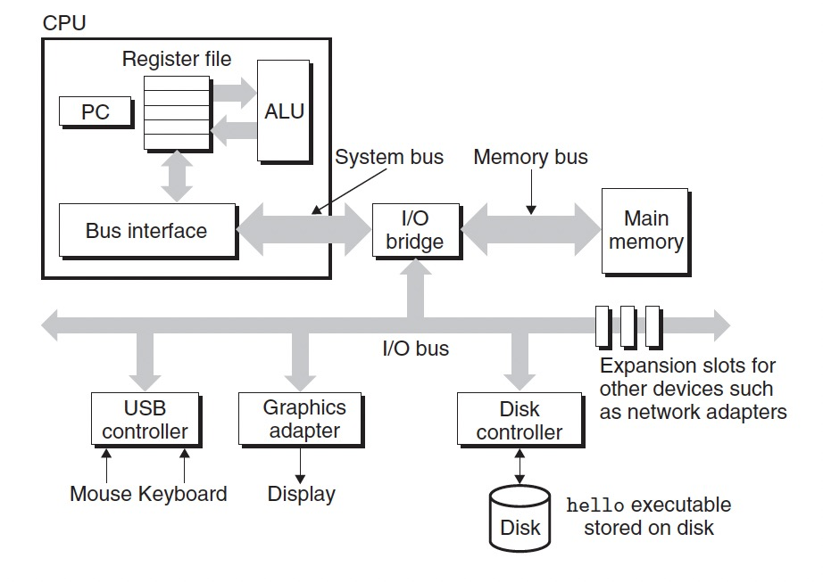
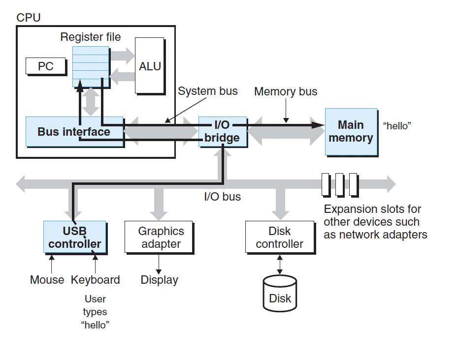
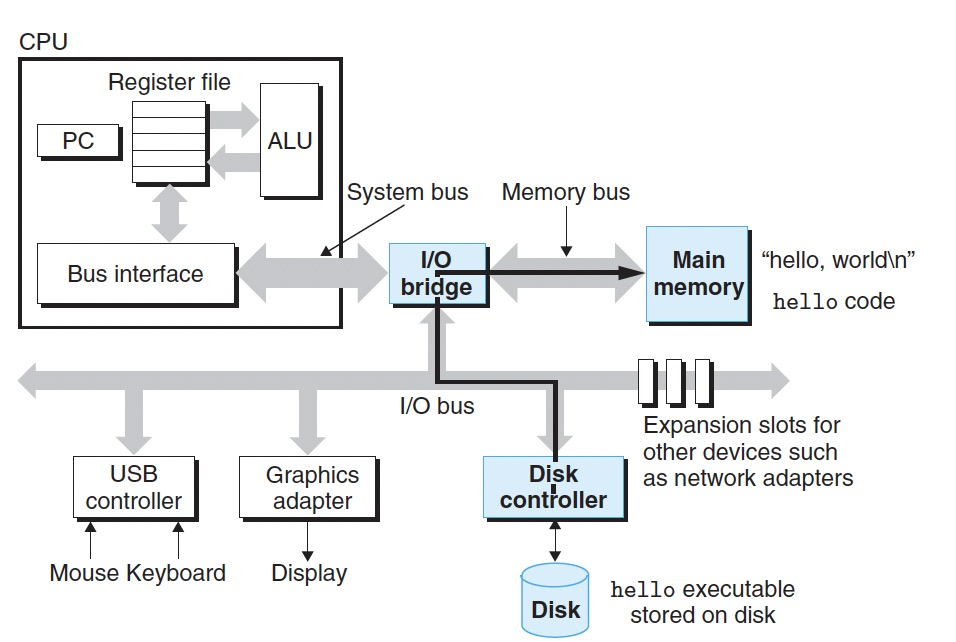
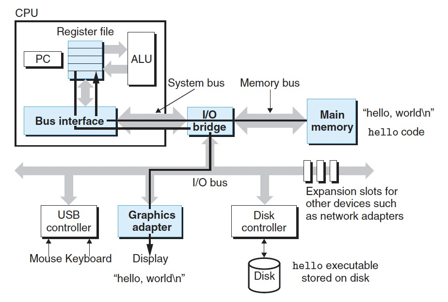

# 1.4 Processors Read and Interpret Instructions Stored in Memory
在我们执行如下命令编译成功hello.c之后：

>linux>gcc -o hello hello.c

此时我们需要打开一个命令行应用程序([shell](../Resource/Linux%20Cheat%20Sheet.md))执行这个可执行程序:
>linux>./hello 
>hello world 
>linux>

## 1.4.1 Hardware Organization of a System

1. Buses 总线 
贯穿整个系统的是一组称为总线的公共通信干线，它们在组件之间来回传送字节信息。 总线通常设计用于传输固定大小的字节块(称为字 word)。字中的字节数是一个基本系统参数，该参数因系统而异。如今大多数机器的字大小为 4 字节(32 位)或 8 字节(64 位)。

2. I/O Devices 
输入/输出（I/O）设备是系统与外部世界的连接。例如用于用户输入的键盘和鼠标、用于用户输出的显示器以及用于长期存储数据和程序的磁盘驱动器（或简称磁盘）。每个I/O设备都是通过控制器或者适配器与IO总线相连。最初，可执行的hello程序驻留在磁盘上。

3. Main Memory 
主存/内存，在处理器执行程序时，它保存程序及其操作的数据。物理上，内存是动态随机存储器的集合。逻辑上，内存是一个从0开始的大数组。

4. Processor 
Program Counter(PC): 一个word的存储空间，用于存放指令的地址，从系统上电开始，CPU就在不断执行PC中的指令。当执行一条指令时，首先需要根据PC中存放的指令地址，将指令由内存取到指令寄存器中，同时PC自动转移到下一条指令的地址（不一定是连续的）。 
Register file 寄存器堆: 是CPU中多个寄存器组成的阵列，每个寄存器都有自己唯一的名字，寄存器就是CPU临时存放数据的一个空间。 
Arithmatic/logic Unit(ALU 算数逻辑单元): 主要功能是进行二位元的算术运算，如加减乘。 

## 1.4.2 Running the hello Program
1. 通过键盘输入`./hello` 

此时键盘通过USB控制器将字符串传入I/O总线，shell程序将输入的字符逐一读入寄存器，处理器会把hello这个字符串放入内存中。

2. 从磁盘加载可执行程序到内存

3. 从内存写出输出到屏幕

CPU将"hello, world\n"从内存复制到寄存器堆，再从寄存器文件复制到显示设备。

